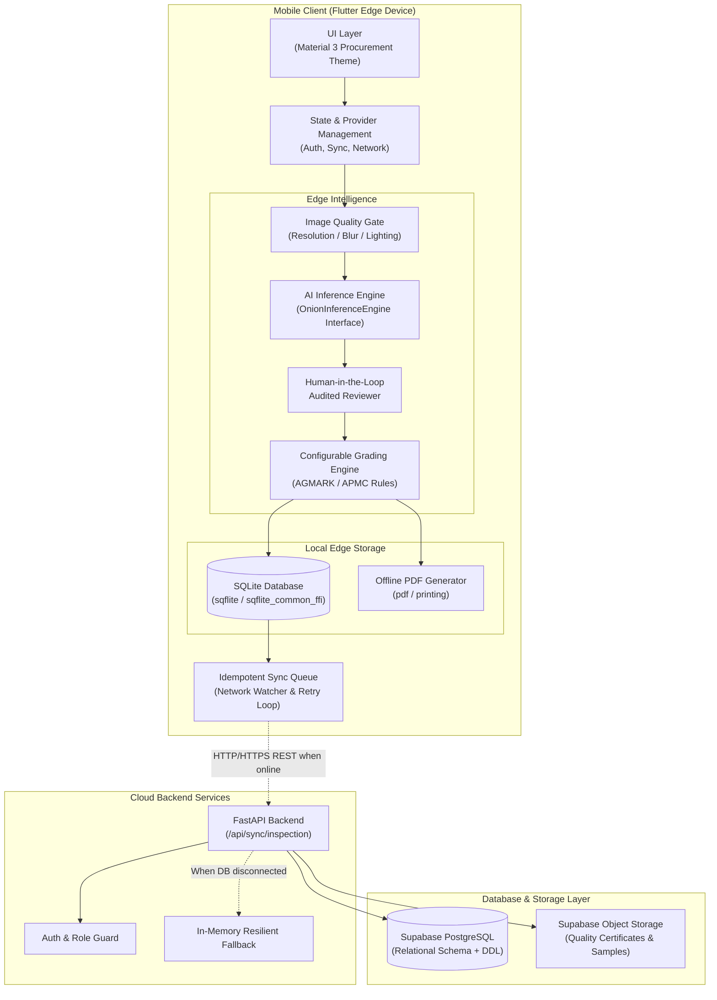
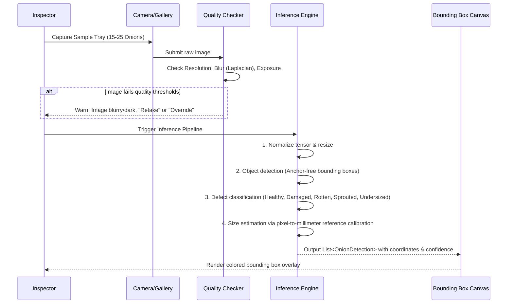
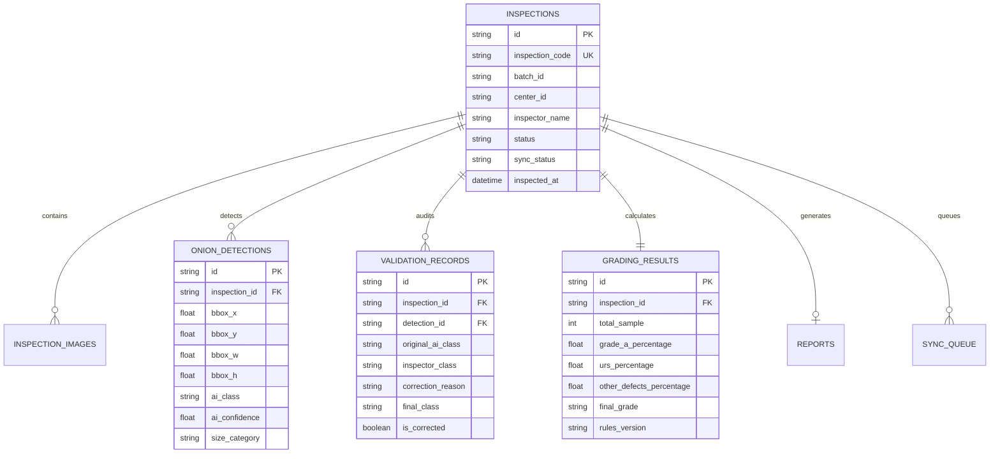
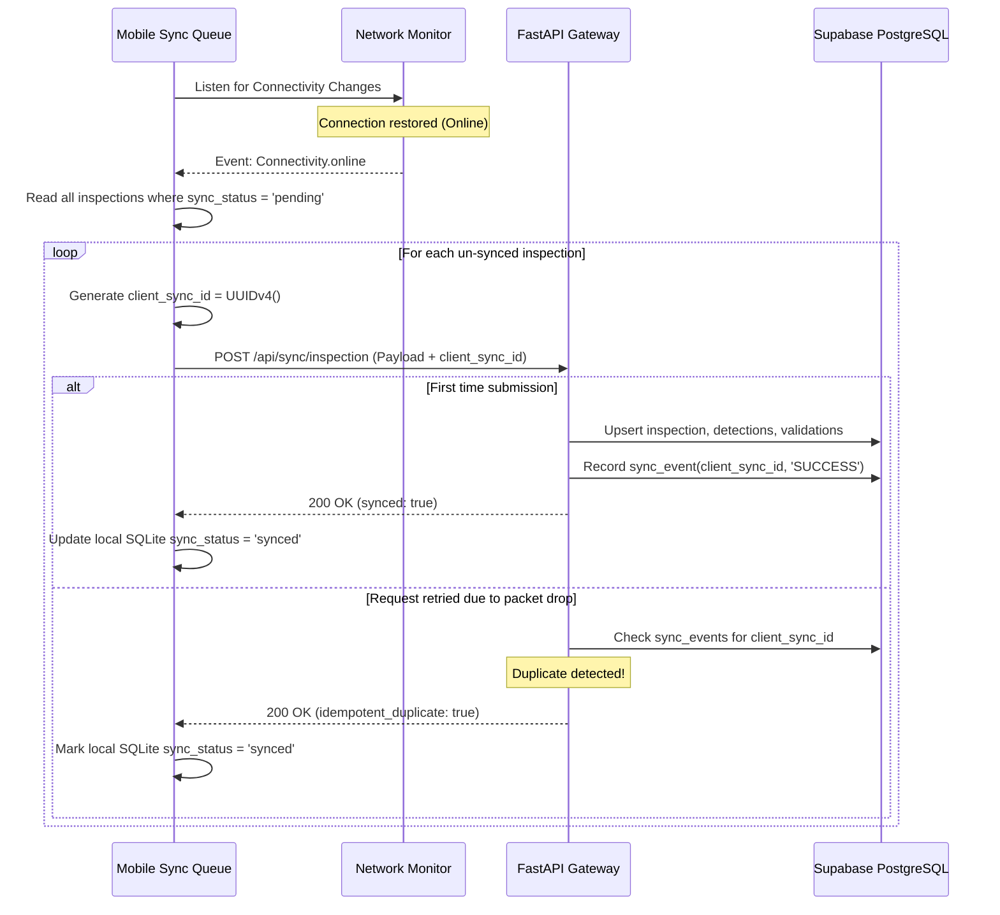

# Technical Architecture: AI-Powered Onion Quality Assessment & Grading System

## 1. Executive Summary & Problem Domain

Quality grading and inspection of onions at Agricultural Produce Market Committee (APMC) procurement mandis in India is historically fraught with challenges:
- **Subjectivity & Human Bias**: Manual visual inspection leads to inconsistent grading across different shifts, inspectors, and procurement centers.
- **Farmer-Trader Disputes**: Disagreements over Under-Recovery Sample (URS) percentage, rot percentage, and size classifications often delay procurement and damage trust.
- **Adverse Field Environments**: Mandis and farm-gate procurement centers frequently suffer from poor, erratic, or non-existent cellular connectivity.
- **Lack of Verifiable Audit Trails**: Paper-based inspection chits are vulnerable to tampering, loss, and lack verifiable computer-vision-backed proof of lot quality.

This system provides a **production-ready, offline-first mobile and cloud architecture** designed to automate onion grading using on-device computer vision while preserving inspector authority through an audited human-in-the-loop mechanism, backed by resilient offline-first data sync to a cloud database.

---

## 2. High-Level System Architecture

The solution operates as a distributed edge-cloud system with an **Offline-First Edge Primary** topology:



---

## 3. Client-Side Mobile Architecture (Flutter)

The mobile client is built on **Flutter (>= 3.13.0)** following Clean Architecture principles, ensuring separation of concerns between presentation, domain logic, and data layers.

### 3.1 Directory Organization

```
onion_app/
├── lib/
│   ├── core/
│   │   ├── constants/          # Enums, defect tags, APMC center registries
│   │   ├── network/            # NetworkService (live & simulated connectivity toggle)
│   │   └── theme/              # Color palettes, typography, Material 3 design tokens
│   ├── data/
│   │   ├── local/              # SQLite DatabaseHelper (Android & Desktop FFI)
│   │   └── repositories/       # Local inspection & sync repository
│   ├── models/                 # Strongly typed models (Inspection, Detection, Validation, Grade)
│   ├── features/
│   │   ├── auth/               # Offline session-aware authentication
│   │   ├── dashboard/          # Metric cards, status badges, sync triggers
│   │   ├── inspection/         # Create form, camera tray capture, image quality dialog
│   │   ├── ai_analysis/        # Abstract inference contract, TFLite/Mock engines
│   │   ├── validation/         # Interactive human review & audit override screen
│   │   ├── grading/            # Deterministic rule engine & final grade presentation
│   │   ├── reports/            # Local PDF report generator & previewer
│   │   ├── history/            # Searchable audit history with full drill-down
│   │   └── sync/               # Resilient background queue & retry worker
│   └── main.dart               # FFI initialization & root provider injection
```

### 3.2 State Management
- Built on `Provider` / `ChangeNotifier` for lightweight, reactive state propagation.
- Three global application-level singletons:
  1. `AuthProvider`: Maintains offline inspector session and active APMC procurement station context.
  2. `NetworkService`: Detects physical network interface state changes while supporting an interactive toggle for mandi testing.
  3. `SyncQueueService`: Manages pending payloads, retry counters, and triggers background synchronization upon network recovery.

---

## 4. Edge AI Inference & Computer Vision Pipeline

To ensure sub-second latency and complete independence from internet connectivity, inference is executed strictly **on-device**.

### 4.1 AI Engine Abstraction Interface
The system decouples inference implementation from business logic via `OnionInferenceEngine`:

```dart
abstract class OnionInferenceEngine {
  String get engineName;
  bool get isSimulation;
  Future<List<OnionDetection>> analyze({
    required String inspectionId,
    required String imagePath,
    int sampleNumber = 1,
  });
}
```

Implementations:
1. **`DemoInferenceEngine`**: Simulates production computer vision by generating multi-onion bounding box grids, defect tags, sizing calibrations, and confidence factors ($82\% - 98\%$) with realistic processing latency.
2. **`RealOnDeviceInferenceEngine`**: Production engine designed for Int8 quantized TFLite models (`assets/models/onion_detector_quantized.tflite`) targeting mobile NPU/DSP or CPU via NNAPI / CoreML.

### 4.2 Computer Vision Step Breakdown



---

## 5. Human-in-the-Loop Validation & Audit Architecture

A central design pillar is **non-repudiation and dispute resolution**. AI serves as a fast assistant; the licensed inspector remains the certifying authority.

### 5.1 Immutable Data Model for Auditing
When an inspector modifies or corrects an AI detection:
- The original AI prediction is **never mutated or deleted**.
- An audited `ValidationRecord` is attached linking to the `OnionDetection`:

| Field | Source | Purpose |
|---|---|---|
| `detection_id` | Foreign Key | References the specific onion detected |
| `original_ai_class` | AI Model | Preserves raw AI output (`Rotten`, `Healthy`, etc.) |
| `ai_confidence` | AI Model | Confidence score of the raw detection (e.g. `0.91`) |
| `inspector_class` | Human Inspector | Overridden label certified by the human |
| `correction_reason` | Human Inspector | Reason code (e.g., *Shadow artifact*, *Dry skin misidentified*) |
| `final_class` | Human Inspector | The authoritative label consumed by the grading engine |
| `is_corrected` | System Flag | Boolean indicating an override occurred |

---

## 6. Configurable Grading Engine

The system strictly decouples **perception** (what is detected on each onion) from **grading policy** (what combination of defects yields Grade A, B, C, or Reject).

### 6.1 Logic Architecture

$$\text{Image} \xrightarrow{\text{AI}} \text{Raw Detections} \xrightarrow{\text{Inspector}} \text{Certified Detections} \xrightarrow{\text{GradingEngine}} \text{Final Grade}$$

### 6.2 Threshold Configuration Schema
Policies are specified via `GradingThresholdConfig`:

```dart
class GradingThresholdConfig {
  final double minGradeAHealthyPercentage; // >= 70.0%
  final double maxGradeARottenPercentage;   // <= 5.0%
  final double maxGradeADamagedPercentage; // <= 15.0%
  final double minUrsHealthyPercentage;     // >= 50.0%
  final double maxUrsRottenPercentage;      // <= 8.0%
  final String rulesVersion;                // 'v1.0-demo-thresholds'
}
```

### 6.3 Grading Criteria Formulas
1. **Grade A (Premium)**:
   - $\text{Healthy \%} \ge 70.0\%$
   - $\text{Rotten \%} \le 5.0\%$
   - $\text{Damaged \%} \le 15.0\%$
2. **Grade B (Fair / Average)**:
   - $\text{Healthy \%} \ge 60.0\%$
   - $\text{Rotten \%} \le 8.0\%$
3. **Grade C (Under-Recovery Sample / URS)**:
   - Fails Grade A/B criteria but meets commercial recovery threshold ($\ge 50\%$ salvageable).
4. **Reject**:
   - $\text{Rotten \%} > 15\%$ or total defect count exceeds lot tolerance.

---

## 7. Local Edge Persistence (SQLite)

The edge client uses SQLite as its primary source of truth:
- **Android/iOS**: Managed via `sqflite`.
- **Desktop (Windows/Linux/macOS)**: Initialized via `sqflite_common_ffi`.

### 7.1 Entity Relationship Diagram



---

## 8. Idempotent Cloud Synchronization

To handle erratic 2G/3G connectivity in rural procurement yards, the sync subsystem is built with **at-least-once delivery with server-side idempotent deduplication**.



---

## 9. Cloud Backend Architecture (FastAPI)

The backend provides a lightweight, stateless REST microservice:
- **Framework**: FastAPI (Python 3.10+) with Uvicorn ASGI server.
- **Validation**: Strict Pydantic models matching the client domain structures.
- **Resilient Fallback Mode**: If external Supabase credentials are not configured, the backend automatically enters an in-memory test mode, allowing offline testing and integration verification without infrastructure dependencies.

### 9.1 API Endpoints

| Method | Route | Description |
|---|---|---|
| `GET` | `/health` | System liveness and Supabase connection health check |
| `POST` | `/api/sync/inspection` | Idempotent bulk sync endpoint for an inspection payload |
| `GET` | `/api/inspections` | Query synced inspections with pagination and center filters |
| `GET` | `/api/inspections/{id}` | Detailed inspection drilldown including validation audit logs |
| `GET` | `/api/analytics/summary` | Mandi-wide quality aggregates (Grade distribution, defect trends) |

---

## 10. Database Schema (Supabase / PostgreSQL)

The cloud persistence layer uses standard PostgreSQL DDL with Foreign Key cascade policies:

1. `procurement_centers`: Mandi locations (Lasalgaon, Pune, Indore, etc.).
2. `users`: Inspector identities, APMC assignments, and credentials.
3. `inspections`: Top-level lot inspection headers and lifecycle status.
4. `inspection_images`: Metadata and storage links for captured trays.
5. `onion_detections`: Raw AI bounding box predictions and confidences.
6. `validation_records`: Complete human override history and reasons.
7. `grading_results`: Aggregated mathematical metrics and final assigned grade.
8. `reports`: Generated PDF documents and cryptographic hash fingerprints.
9. `sync_events`: Audit table tracking `client_sync_id` for deduplication.

---

## 11. Security, Non-Repudiation & Offline Verification

1. **Tamper-Evident Local Reports**:
   - PDF certificates are generated entirely on-device using the `pdf` library.
   - Contains an embedded QR code storing a cryptographic JSON payload (`inspection_code`, `batch_id`, `final_grade`, `inspector_id`, `timestamp`).
   - Any external buyer can scan the QR code to verify report integrity even without logging into the portal.
2. **Dual-Audit Trail**:
   - Discrepancies between AI and inspector are logged. If an inspector consistently overrides rot detections to "Healthy", automated analytics flags the procurement center for quality review.
3. **Idempotent Sync Tokens**:
   - Every transaction bears a cryptographically unique `client_sync_id` preventing double-counting of procurement batches.

---

## 12. Verification & Testing Matrix

The project includes test automation across both layers:
- **Mobile Unit & Engine Tests**:
  - `onion_app/test/grading_engine_test.dart`: Validates edge cases for Grade A, URS, and Reject threshold calculations.
  - `onion_app/test/ai_engine_test.dart`: Validates AI inference output shape, coordinates, and mock engine determinism.
- **Backend End-to-End Tests**:
  - `backend/test_sync.py`: Validates FastAPI endpoints, idempotency handling, payload parsing, and batch retrieval.
